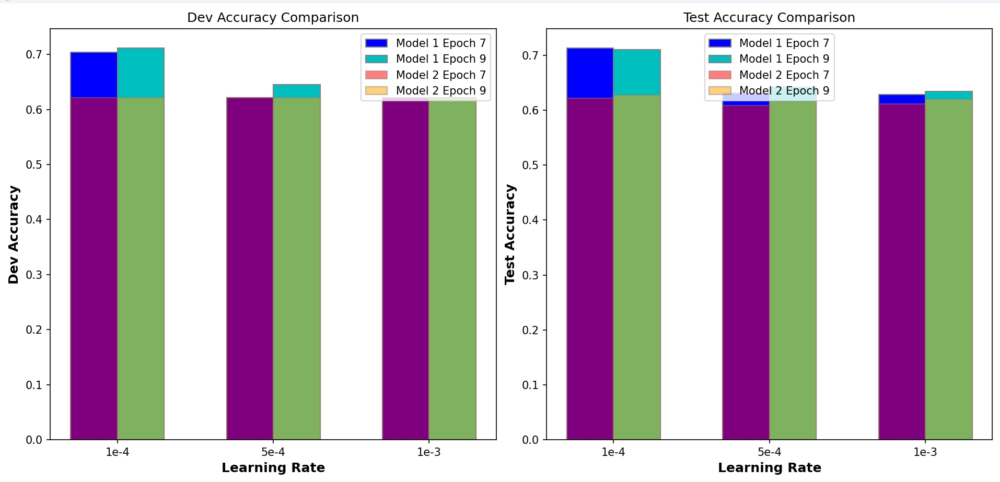
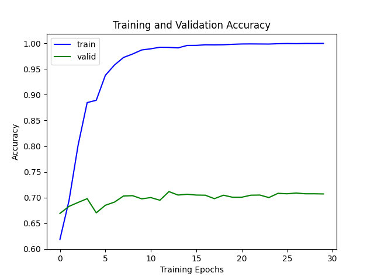
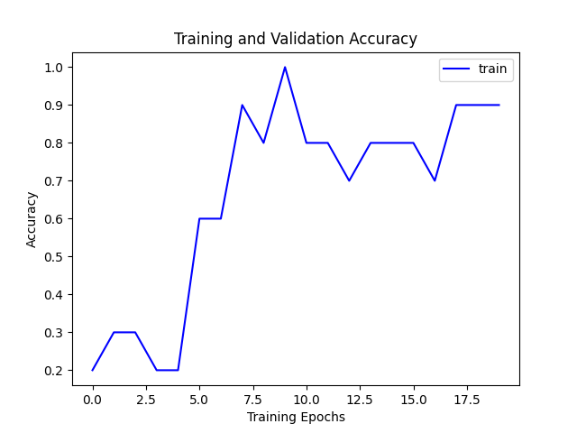

# Fine-tuning, PEFT & In-Context Learning on BoolQ

Fine-tuning encoder language models (DistilBERT, RoBERTa) for the **BoolQ** yes/no
question-answering task, comparing **full fine-tuning** against **parameter-efficient
fine-tuning (PEFT)** strategies, plus a **few-shot in-context learning** baseline with a
GPT model.

This was a programming assignment for **JHU CS 601.471/671: Self-Supervised Models**.
The training/eval loops, the PEFT forward passes, and the optimizers were implemented on
top of course-provided starter scaffolding (see [Attribution](#attribution)).

## What's here

| Component | File | What it does |
|-----------|------|--------------|
| Full fine-tuning | `base_classification.py` | Fine-tunes all parameters of an encoder (DistilBERT) on BoolQ. Includes a "overfit a tiny subset" sanity check. |
| PEFT comparison | `classification.py` | A configurable classifier supporting **full**, **head-only**, and **prefix** tuning (`--type`), used to compare tuning strategies on RoBERTa. |
| In-context learning | `openai_gpt-boolq.py` | 8-shot (4 yes / 4 no) in-context learning baseline on BoolQ using `gpt-4o-mini` via the OpenAI API. |
| Plotting | `results_bar_plot.py` | Bar plots of dev/test accuracy across learning rates and epochs. |

## The task

**BoolQ**: given a passage and a yes/no question, predict the answer. Framed as binary
sequence classification (train 8000 / dev 3270 / test 1427).

## Fine-tuning strategies compared

- **Full fine-tuning**: update every weight in the backbone + classifier head.
- **Head-only**: freeze the pretrained backbone, train only the classification head.
- **Prefix tuning**: freeze the backbone, learn a set of continuous prefix vectors
  (`--prefix_length`) prepended to the input; a parameter-efficient method.

The trade-off: full fine-tuning gives the best accuracy, while the PEFT methods train a
small fraction of the parameters at some accuracy cost.

### Results (RoBERTa-base, test accuracy)

| Strategy | Test accuracy |
|----------|:-------------:|
| Full fine-tuning | ~0.69 |
| Head-only | ~0.63 |
| Prefix tuning | ~0.61 |

A learning-rate x epochs sweep (lr in {1e-4, 5e-4, 1e-3}, epochs in {7, 9}) for both
DistilBERT and RoBERTa is in [`logs/`](logs/).

Dev and test accuracy across the sweep:



Full training run (DistilBERT):



Overfitting a tiny subset, a sanity check that the training loop learns:



## Setup

```bash
conda create -n ssm_hw6 python=3.10.13
conda activate ssm_hw6
pip install -r requirements.txt
```

## Running

Full fine-tuning (DistilBERT):

```bash
python base_classification.py --device cuda --model "distilbert-base-uncased" \
    --batch_size 128 --lr 1e-4 --num_epochs 7
```

PEFT comparison (RoBERTa), swapping `--type` between `full`, `head`, `prefix`:

```bash
python classification.py --device cuda --model "roberta-base" \
    --type prefix --prefix_length 128 --batch_size 32 --lr 5e-5 --num_epochs 8
```

In-context learning baseline (needs an OpenAI API key):

```bash
export OPENAI_API_KEY=sk-...        # or put it in a .env file (git-ignored)
python openai_gpt-boolq.py
```

Add `--small_subset` to either training script to overfit a tiny slice for quick
debugging. On a Slurm cluster, `sbatch.sh` shows the batch-job setup used for GPU training.

## Repo layout

```
.
├── base_classification.py   # full fine-tuning (DistilBERT)
├── classification.py        # full / head / prefix tuning (RoBERTa)
├── openai_gpt-boolq.py      # few-shot in-context learning baseline
├── results_bar_plot.py      # accuracy plots
├── requirements.txt
├── sbatch.sh                # Slurm GPU job script
├── images/                  # result plots
└── logs/                    # training run logs (LR/epoch sweep + per-part experiments)
```

## Skills demonstrated

Transformer fine-tuning, HuggingFace `transformers` / `datasets`, parameter-efficient
fine-tuning (head-only, prefix tuning), in-context / few-shot learning, hyperparameter
sweeps, GPU training on a Slurm HPC cluster, PyTorch.

## Attribution

Built for JHU CS 601.471/671. The data pipeline, argument parsing, and model
scaffolding were provided as course starter code; the training loops, evaluation
functions, PEFT forward passes, and optimizers were implemented as part of the
assignment. Datasets: [BoolQ](https://huggingface.co/datasets/boolq).
